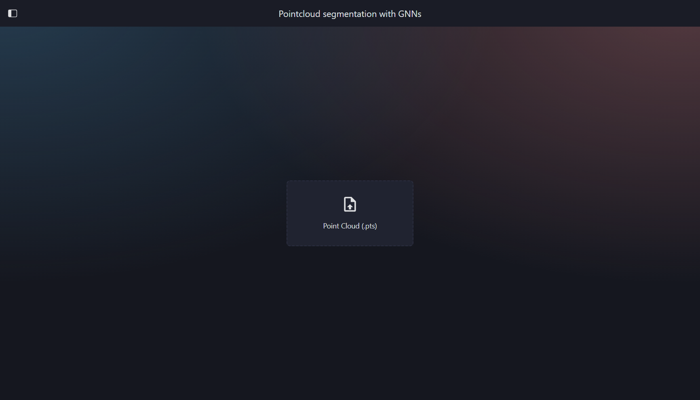
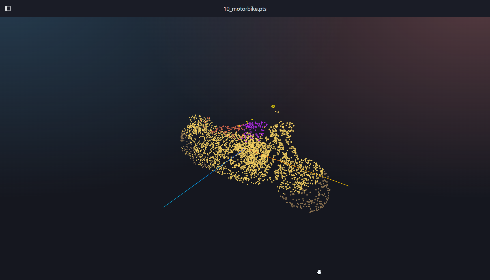
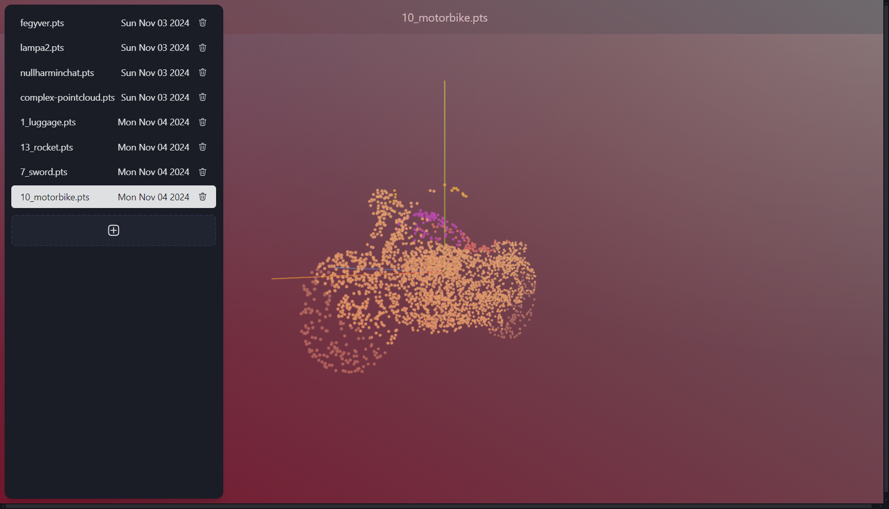

# Point Cloud Segmentation with GNNs - Front-End

## Just deployment

- Download the `docker-compose.yaml`
    - Provide the inferer API url in the `PUBLIC_API_URL` environment variable.
- Run `docker-compose up` in the same directory
- Open `http://localhost:8080` in your browser (if 8080 is the port you specified in the `docker-compose.yaml`)
- You can test the app with the provided sample files in the `src/test` directory.

## Developing

Install dependencies:

```bash
npm i
```

Run development server:

```bash
npm run dev

# or start the server and open the app in a new browser tab
npm run dev -- --open
```

## Building

To create a production version of your app:

```bash
npm run build
```

You can preview the production build with `npm run preview`.

## State of the project

- Currently the front-end only implements the segmentation calls, the classification with the legend is not implemented yet.





